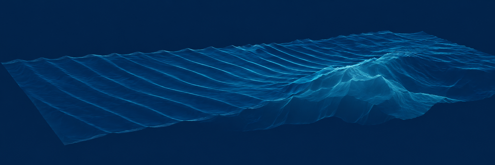
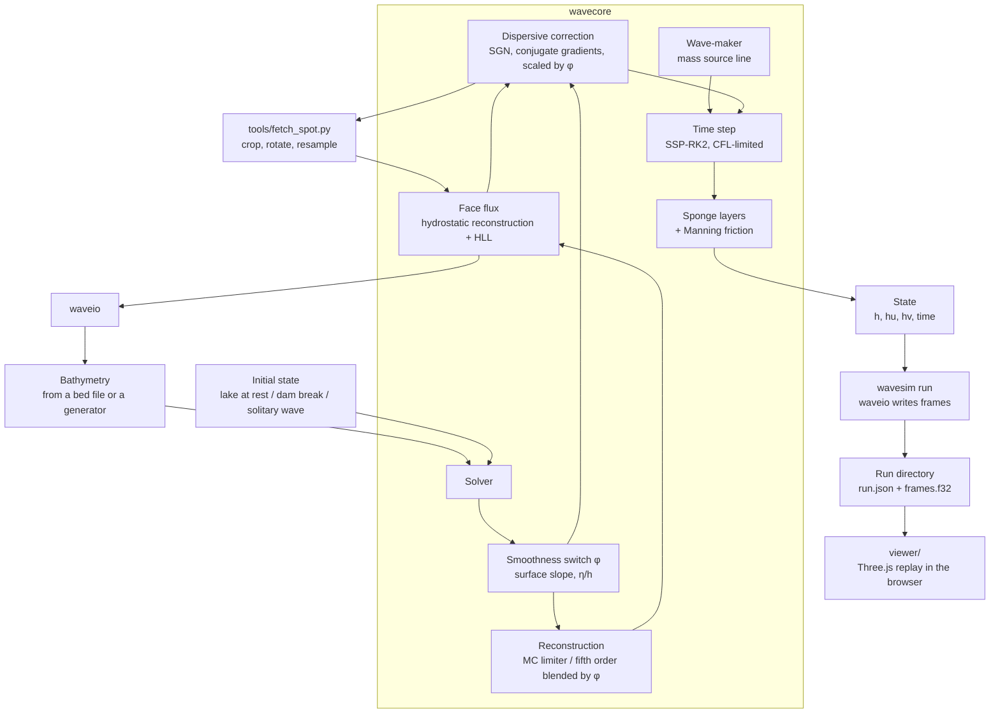

# wavesim



A nearshore wave solver in Rust, built to be verified before it is trusted.

`wavesim` solves the nonlinear shallow-water equations, with optional Serre–Green–Naghdi dispersion so that big swells shoal and break where they should, on a Cartesian grid to model how water moves over a sloping or uneven bed, including real 3 m bathymetry cropped from NOAA data. The numerical core, `wavecore`, is a pure library with no I/O, no graphics and no GDAL, and its kernels are pure functions of the cells they touch.

It is a depth-averaged model. It captures shoaling and breaking as a bore, not an overturning lip.

## Table of Contents

- [Overview](#overview)
- [Documentation Map](#documentation-map)
- [Architecture](#architecture)
- [Quick Start](#quick-start)
- [Run a swell over a real bed](#run-a-swell-over-a-real-bed)
- [View a run](#view-a-run)
- [Numerics](#numerics)
- [Verification](#verification)
- [Project Structure](#project-structure)
- [Development](#development)
- [Limitations](#limitations)
- [License](#license)

## Overview

| Component | Description |
|---|---|
| **Grid** | Uniform Cartesian grid in metres, with three ghost layers on every side |
| **Bathymetry** | Bed generators: flat, plane beach, rough bed |
| **State** | Depth `h` and momentum `hu`, `hv`; reflective walls; volume and momentum diagnostics |
| **Forcing** | Internal wave-maker (oblique incidence supported), absorbing sponge layers, Manning bottom friction, optional periodic boundaries in `y` |
| **Bed files** | A documented format for a real seabed; `tools/fetch_spot.py` crops one from a remote GeoTIFF, rotated so `+x` is the wave direction |
| **Runs** | `wavesim run` sends a swell over a bed and writes frames (the surface and a breaking indicator) in a documented format a viewer can read. It carries the swell across the shelf on cells twice as large and runs the reef on the bed's own cells, and it refuses to start a run it estimates would take longer than its limit |
| **Viewer** | `viewer/`: a browser replay of a run in 3D (Three.js and TypeScript): terrain from the bed, the surface animated from the frames, foam where the model says the wave breaks, a side view of one line across the break, and maps of where waves break and how steep they get |
| **Solver** | Well-balanced finite-volume scheme: hydrostatic reconstruction, HLL flux, and first order, second order (MUSCL with an MC limiter), or fifth order (unlimited where the wave is smooth, blended back to the limiter near steep fronts), with SSP-RK2 |
| **Dispersion** | Serre–Green–Naghdi correction solved by preconditioned conjugate gradients, switched off where waves break; see [docs/dispersion.md](docs/dispersion.md) |

Design rules:

1. **Verification first.** Numerical behaviour is pinned by tests with known answers.
2. **Pure numerics.** `wavecore` takes arrays in and gives arrays out. It has no dependencies.
3. **Kernels as pure functions.** A face computation depends only on the two cells that share it, with no allocation or global state.

## Documentation Map

| Doc | What it covers |
|---|---|
| [docs/data-format.md](docs/data-format.md) | The bed and run file formats, the coordinate frame, and how to read a run from Python or JavaScript |
| [docs/dispersion.md](docs/dispersion.md) | The dispersive model, the breaking switch, what was tried and dropped, the verification numbers and the limits |
| [docs/bathymetry.md](docs/bathymetry.md) | Notes on real-world bed data: NOAA CUDEM for Hawaii, its provenance and caveats, and what was found for Portugal |

## Architecture



## Quick Start

### Prerequisites

- Rust (stable), installed through [rustup](https://rustup.rs)
- [uv](https://docs.astral.sh/uv/) for the fetch tool (only needed to get real bathymetry)
- Node 20 or newer for the viewer (only needed to watch a run)

`wavecore`, the numerical crate, has no dependencies. `waveio` and `wavesim` use `serde`, `serde_json`, `thiserror` and `clap`.

### Run the tests

```bash
git clone <this-repo>
cd wavesim
cargo test
```

That takes about 15 seconds and skips the physics checks that run whole simulations. Run those too, which takes about a minute, whenever the numerics change:

```bash
cargo test --release -- --include-ignored
```

### Test the fetch tool

```bash
uv run --python 3.12 --with pytest --with rasterio --with numpy --with scipy --with pyproj pytest tools
```

### Test the viewer

```bash
cd viewer && npm install && npm test
```

### Lint and format

```bash
cargo fmt --check
cargo clippy --all-targets
```

### Use the library

```rust
use wavecore::{Bathymetry, Grid, Solver, State};

let grid = Grid::new(64, 48, 3.0, 3.0);            // 64 x 48 cells, 3 m each
let bed = Bathymetry::plane_beach(&grid, 0.02, 8.0); // 2% slope, 8 m deep offshore
let mut state = State::lake_at_rest(&grid, &bed, 0.0);
let solver = Solver::new(grid, bed);

let dt = solver.stable_dt(&state);
solver.step(&mut state, dt);
```

## Run a swell over a real bed

Fetch the seabed once. This reads only the window it needs (under 1 MB) from NOAA's public bucket:

```bash
uv run --python 3.12 --with rasterio --with numpy --with scipy --with pyproj \
    tools/fetch_spot.py pipeline
```

```bash
cargo run --release -p wavesim -- info data/pipeline.json
```

Send a swell over it:

```bash
cargo run --release -p wavesim -- run data/pipeline.json --height 2.5 --period 14
```

That writes `out/pipeline/` (both `data/` and `out/` are git-ignored): the reef on the bed's own cells, and in `out/pipeline/coarse/` the coarse run that carried the swell across the shelf. Options: `--tide` (metres above mean sea level), `--duration`, `--frame-interval`, `--manning`, `--dispersive false` (plain shallow water, for comparison), `--single` (everything on the bed's own cells, on one grid), `--max-minutes`, `--priority`, `--threads`, `--out`.

**What the run plans for itself.**

- **Where the wave-maker goes.** It makes a sinusoid, and a real swell is only close to one in deep enough water: in shallow water a second harmonic is bound to it (sharper crests, flatter troughs), and a sinusoid sheds the harmonic it lacks as a separate wave that beats with the swell and moves where it breaks. So the maker goes in the shallowest water where that harmonic is at most 10% of the wave, along its whole line: about 23 m for a 2.5 m, 14 s swell at Pipeline, which puts it beyond the 10–14 m shelf the swell crosses for a kilometre before the reef. The bigger and longer the swell, the deeper it goes; a bed that does not reach deep enough is an error that says so.
- **How much bed it uses.** Everything further offshore than the maker and its sponge (one and a half wavelengths) need is cropped off, so one long bed serves every swell.
- **How long it runs.** By default, long enough for the swell to ramp up, reach the shore at its group speed, and break four times (about 240 s at Pipeline).
- **Two grids.** The swell crosses the shelf on cells twice as large as the bed's, where the fifth-order scheme keeps its height (6 m cells across the Pipeline shelf come within 1.5% of 3 m ones). The reef runs on the bed's own cells, from where the water is shallower than 2.5 wave heights or the swell shorter than 20 coarse cells, whichever is deeper (8 m at Pipeline). Along its offshore edge, a relaxation zone a wavelength wide pulls the fine run towards the coarse one: the swell comes in, and what the reef sends back goes out. The fine run starts two periods before the swell reaches it. On a test beach the two grids together give the same waves as one fine grid to within 2.3% (8.3% at worst), and the run warns if the coarse run breaks inside the zone, in the middle half of the width, where it would hand the fine grid a broken wave. A swell too short for the coarse cells is refused, and `--single` runs everything on one grid.
- **The sides are walls.** For a swell travelling along `+x` a wall is a mirror, so an alongshore-uniform bed gives an exactly uniform run. On a real bed refraction carries energy sideways, and the mirror image of the bed at a wall can focus it: over the Pipeline shelf, a 600 m wide domain gets wave heights in its middle wrong by 10% (median, up to 36%) against a 2 km wide one, and a 1.2 km wide one by 4% (up to 12%). So the bed is twice as wide as the part worth looking at, the runs record the outer quarter on each side as a margin, and the viewer trims it. Both grids have their walls in the same places; relaxing the fine grid's sides towards the coarse run instead imposed the coarse surf zone, which it cannot resolve, on the fine one (13–22% off near the break).

The swell travels along `+x` of the bed's frame, so its direction is chosen when the bed is fetched (`bearing` in `spots.toml`). Add your own spot by adding a table to `spots.toml`.

**Running it on a laptop.**

- A 2.5 m, 14 s swell at Pipeline crosses the shelf on 319 × 200 cells of 6 m and runs the reef on 179 × 400 cells of 3 m, for 244 simulated seconds: **5.7 minutes on four threads on the efficiency cores**, cool and quiet, using about 3.4 of them, within the default limit of 7 minutes. With `--priority normal` it takes about a third as long, on the performance cores.
- The solver uses **4 threads** by default, not every core. Raise it with `--threads`; `--threads 0` uses all. The results are byte-identical for any number.
- For a quick look, fetch a coarser bed with `tools/fetch_spot.py pipeline --cell 6` and run it with `--single`: 6 m cells get the refraction over the shelf right but are too coarse for the break itself.

## View a run

```bash
cd viewer
npm install
npm run dev
```

Open the address it prints (http://localhost:5173). The dev server lists every run in `out/` (set `WAVESIM_RUNS` to use another folder), and `?run=pipeline` opens one directly. You can also drop `run.json`, `bed.f32` and `frames.f32` onto the page, or use **Open files…**.

The page draws the bed as terrain and the surface as a mesh displaced by the stored `eta`, re-uploaded every frame. Between stored frames it interpolates with a cubic, because a straight line between frames 2 s apart cuts the crest of a 14 s wave by 10%.

**What it shows.**

- **Only the sea.** The strip seaward of the wave-maker exists for the numerics (the source radiates both ways, and the sponge absorbs the seaward half), so the viewer hides it. **Sea only** switches that off, and **Model zones** marks the wave-maker line and the sponge.
- **Foam where the model says the wave breaks.** The solver writes a `breaking` field for each frame, and the foam follows it. Runs without that field fall back to a slope rule.
- **Side view.** A chart of one line across the break: the bed, the water, and the surface coloured by how close to breaking it is, with the steepest face marked and a readout. A yellow line in the 3D view shows where it is taken; the slider moves it along the shore. Besides the instantaneous values it reports, for that line over the whole run, where it gets steepest and where it breaks.
- **Maps.** A colour overlay of what happened over the whole run: **where it breaks** (the fraction of the run each cell spent breaking) or **how steep** (the steepest the surface ever got, clear below a slope of 0.06 and full red at 0.4).
- **Cameras.** *Oblique* along the break, *Top*, and *Beach*, a surf-cam view from the waterline looking out along the lineup.
- **Controls.** Play and pause (space), scrub, step by a frame (arrow keys), speed, and a **Height ×** slider (default 4) that stretches heights so small waves show.

`npm run build` makes a static site in `viewer/dist`; it contains no runs, which are large and git-ignored.

## Numerics

The solver integrates the conservative nonlinear shallow-water equations for water depth `h` and depth-integrated momentum `(hu, hv)` over a bed elevation `b`:

```text
∂h/∂t      + ∂(hu)/∂x + ∂(hv)/∂y = 0
∂(hu)/∂t   + ∂(hu² + g h²/2)/∂x + ∂(huv)/∂y = -g h ∂b/∂x
∂(hv)/∂t   + ∂(huv)/∂x + ∂(hv² + g h²/2)/∂y = -g h ∂b/∂y
```

| Aspect | Choice | Why |
|---|---|---|
| Grid | Uniform Cartesian, metres, three ghost layers | Matches raster bed data; fifth-order reconstruction of a face reads three cells on each side, and the dispersive terms take a divergence, then a gradient of it, then a gradient again, which also reaches three cells out |
| Discretisation | Cell-centred finite volume | Conserves mass and momentum exactly |
| Bed source term | Hydrostatic reconstruction (Audusse et al. 2004) | Still water stays still over any bed; depth stays non-negative at a shoreline |
| Reconstruction | The free surface `h + b` and the velocities; MC limiter (`Order::Second`) or unlimited fifth order blended to it by `φ` (`Order::Fifth`) | Reconstructing the surface, not the depth, keeps a flat surface exactly flat; the limiter clips every smooth crest, which damps waves on a coarse grid, and fifth order damps them far less than third: a 14 s swell on 6 m cells keeps its height over a kilometre, where third order lost 6% (and 14% across the Pipeline shelf) |
| Flux | HLL Riemann solver | Robust at shocks and wet/dry fronts |
| Breaking | Shocks captured by the Riemann solver, with the dispersive terms and the fifth-order reconstruction faded out by `φ` where the wave is steep or tall for its depth | The shock dissipates the wave, so there is no separate breaking closure; the thresholds are tuned to textbook breaking indices |
| Dispersion | Serre–Green–Naghdi (flat-bed operator), `h w − ∇(c ∇·w) = r`, solved each stage by Jacobi-preconditioned conjugate gradients from the previous solution | Fully nonlinear; symmetric positive definite; 7 to 11 iterations per solve |
| Boundaries | Reflective walls; optionally periodic in `y` | Periodic gives an alongshore-uniform wave with no edge diffraction |
| Wave input | Internal mass source on a line (Wei et al. 1999), Gaussian-weighted, normalised over the discrete grid | Injects exactly the requested amplitude at any resolution; oblique waves via a phase shift along the line |
| Absorption | Sponge layer: depth relaxes to that of still water (none on land) and momentum to zero at the same rate, quadratic ramp | Lets waves leave without reflecting, and never speeds water up |
| Friction | Manning, semi-implicit | Exact for one-directional quadratic drag; never reverses the flow |
| Time step | Adaptive, CFL 0.4; SSP-RK2 (second and fifth order) or forward Euler (first order) | |

Cells shallower than `1e-8` m count as dry and carry no velocity. A cell drops to first order where it or a neighbour is shallower than 1 mm, or where reconstruction would leave a face without water, so wet/dry fronts stay positive and well-balanced.

Choose the order with `Solver::with_order`; the default is `Order::Second`. Add dispersion with `Solver::with_dispersion(Dispersion::default())`; `wavesim run` uses `Order::Fifth` with dispersion unless you pass `--dispersive false`.

**Wave-maker calibration.** A source of strength `Q` per unit length radiates amplitude `Q / (2 c_g cos θ)` on each side, with `c_g` the linear **group** speed at the source (`sqrt(g h)` in shallow water; the phase speed divided by `1 + (kh)²/3` with dispersion), and the strength is boosted to undo the roll-off `exp(−k_x²σ²/2)` of the source's Gaussian profile. A sponge behind the maker absorbs the half that travels away from the domain of interest. With `periodic_y`, an oblique maker's `k_y · Ly` must be a whole multiple of 2π; `Solver` panics if it is not.

## Verification

| Test | Checks |
|---|---|
| Lake at rest over a rough bed | Still water stays still (momentum below 1e-11) and volume is conserved over 500 steps |
| Lake at rest with dry bumps | The same, with wet/dry fronts beside steep bed steps |
| Dam break onto a dry bed | Volume conserved, depth non-negative, water advances into the dry region |
| Wet-bed dam break vs the Stoker solution | Second order at least 4× more accurate than first order; observed L1 convergence rate above 0.9 (measured 1.07) |
| Dry-bed dam break vs the Ritter solution | The same criteria (measured rate 1.03) |
| Exact-solution self-check | The Stoker middle state satisfies the Rankine–Hugoniot conditions |
| Wave-maker amplitude | Radiated amplitude within 2% of the request on both sides (measured 0.4% and 0.6% low, after correcting for the source's spectral roll-off; it was 1.4% and 1.6% before) |
| Green's law | Amplitude ratio over a sloping bed within 2% of `(h₁/h₂)^¼` (measured 0.14% off) |
| Snell's law and wave action | Oblique long waves on a beach: alongshore phase lag equals the imposed `k_y` (within 0.05 rad, measured 0.003), the wave turns from 29.3° to 26.8°, and amplitude follows `a² c cos θ = const` (measured 0.02% off) |
| Solitary-wave runup | Non-breaking runup within 10% of Synolakis' law (measured 1.5% high) |
| Friction | Attenuation over 100 m within 0.03 of the quadratic-drag prediction (measured 0.919 against 0.911) |
| Manning factor | Equals the exact solution of quadratic drag |
| Dispersion operator | Symmetric and positive definite to 1e-10, with walls and with periodic wrapping, so conjugate gradients is safe |
| Dispersion relation | A standing wave oscillates at 1.4261 rad/s (fifth order) against the SGN theory's 1.4247; shallow water would give 1.7629 (24% off) |
| Fifth-order reconstruction | Exact for quartics at both faces of a cell |
| A swell crossing a shelf on coarse cells | 14 s in 12 m on 6 m cells (24 to a wavelength): at least 97% of its height after 1 km, bound set before the first run (measured 100.7%; the third-order scheme keeps 94.2% and fails) |
| Exact SGN solitary wave | `a/h = 0.2` for 20 s: amplitude 0.2001, crest within 0.01 m of the exact position, shape error 0.2%; shallow water steepens and ends 57% off |
| Wave-maker with dispersion | Amplitude 0.0498 and 0.0499 against 0.05, wavelength within 0.1 rad of the SGN phase lag over 40 m (shallow water would be off by 0.25 rad) |
| Big swell in deep water | A 2.5 m, 14 s swell in 8 m keeps at least 90% of its energy over 400 m (measured 95%); shallow water keeps 14% |
| Shoaling and breaking on a 1:30 beach | Shoaling from 6 to 3.5 m of x1.13 matches Green's law (x1.14); the tallest wave has `H/h` 0.71 at 3.0 m depth (textbook 0.55 to 1.2); the surf zone stays depth-limited (`H/h` 0.97 at most in 1 to 2.5 m) |
| Dispersive solves | Converge every time, in under 20 iterations on average |
| Thin film at a run-up | A white-box test: changing a 1 mm film's speed from 1 to 1000 m/s changes nothing about its neighbours, and the test fails if the masking is removed |
| Masked dispersive operator | Symmetric and positive definite with a patchy mask, masked cells exactly zero |
| Threads | The threaded and serial builds give byte-identical `frames.f32` on the real Pipeline bed (same SHA-256), so threading cannot change a result |
| Breaking field | Written for every frame; 0 in still water; a clear reading (above 0.8) occurs only in shallow water on a beach test |
| Steepness and break maps | Peak slope per cell over the run, ignoring shallow water; the fraction of frames each cell was breaking, cached per threshold |
| Still water with dispersion | Over a rough bed, with and without dry bumps, momentum stays below 1e-9 for both orders |
| Bed and run files | Round-trip exactly; wrong length, NaN values and unknown formats are rejected with a clear message |
| Full run on a synthetic beach | Frame count and times are right, the first frame is still water, and the wave in the frames has the requested amplitude (between 0.6 and 1.3 times the request) |
| Run planning | The wave-maker sits where a sinusoid lacks at most a 10% second harmonic and one cell shoreward it would lack more; the second harmonic has the Stokes deep- and shallow-water limits; a higher tide lets it sit further shoreward; the planned duration matches the analytic travel time up a plane beach within 5%; impossible setups are explained |
| Walls at the sides | On an alongshore-uniform beach every row of every frame is the same to 1e-6 m (fails with absorbing side strips) |
| Cropping | Keeps the values exactly and moves the frame's origin along `+x`, and along `+y` 90° counter-clockwise from it |
| Sponge over land | A sponge relaxes depth and momentum at the same rate, so water on land inside it keeps its velocity to 1e-6 (the old rule sped it up 14% in three steps; on Pipeline it left films microns deep at tens of metres per second, which cut the time step eightfold) |
| Relaxation zones | Relaxing towards still water keeps a lake at rest over a rough bed; towards a moving target, depth and momentum follow the exact exponential and the water never speeds up |
| Two grids against one | On a 1:50 beach a 0.5 m, 14 s swell crosses 250 m on 4 m cells and then the reef on 2 m cells: within 4% of one 2 m grid on average and 10% at any point, bounds set before the first run (measured 2.3% and 8.3%); on an alongshore-uniform beach the rows agree to a ten-thousandth of the wave height (measured 6e-6 m); a swell shorter than 20 coarse cells at the wave-maker is refused |
| Budget | A run estimated to take longer than its budget is refused before it writes anything; one that runs over its limit anyway stops and keeps a valid shorter run |
| Coarsening | 2 x 2 blocks are averaged, the leftover edge cells dropped |
| Viewer data layer | 33 tests: header and file validation, frame offsets, cubic interpolation (follows a wave with under 2% error where a straight line errs by 10%; never puts water below the bed), runs that start after zero, the side margins, and reading the exact bytes the Rust writer produces |
| Rust and viewer agree | `waveio`'s golden test writes a tiny run and compares it byte for byte with the fixture the viewer's tests read; if the format drifts, one of them fails |
| Fetch tool | On a synthetic plane, `+x` follows the bearing and `+y` is 90° counter-clockwise from it, for four bearings; clipping is counted; a request outside the raster is an error |

The lake-at-rest and dam-break conservation tests run for both orders. L1 error at a shock converges at rate 1 at best, so a rate near 1 is the target, not 2.

**The dispersive tests fix their bounds before running.** Where there is an exact answer (the dispersion relation, the solitary wave) the test compares against it; for breaking there is none, so the bounds are the textbook range for the quantity. Two of them were revised after a first run, and each says why in its comment: the surf-zone check originally looked as shallow as 0.3 m, which is the swash, where a bore's height exceeds the still depth by definition; and the wave-maker test originally compared crest-to-trough height, which is not conserved for a wave in the Ursell regime (see [docs/dispersion.md](docs/dispersion.md)).

**Two shoaling tests run in the linear regime.** Green's law and the wave-action law are linear results. At 3 cm in about 2 m of water, nonlinear steepening of shallow-water waves already drains a few percent of the first harmonic over 160 m, so those two tests use 5 mm waves. The beaches are long enough that the measurement points sit well away from the sponge, whose small reflection otherwise ripples the amplitude by a few percent.

`cargo test` takes about 15 seconds and skips the tests marked slow, which run whole simulations; `cargo test --release -- --include-ignored` runs everything in about a minute. The test profile is optimised (`[profile.test] opt-level = 3`).

## Project Structure

```text
wavesim/
├── Cargo.toml                  # workspace
├── LICENSE
├── README.md
├── spots.toml                  # real-world spots the fetch tool can crop
├── docs/
│   ├── bathymetry.md           # real-world bed data notes
│   ├── dispersion.md           # the dispersive model, what was tried, limits
│   └── data-format.md          # bed and run file formats
├── img/
│   └── header-banner.png
├── viewer/                     # browser replay: Vite, TypeScript, Three.js
│   ├── index.html
│   ├── vite.config.ts          # also serves out/ as /runs/
│   ├── src/
│   │   ├── run.ts              # header checks, frames, interpolation (no DOM)
│   │   ├── load.ts             # fetch or file loading
│   │   ├── view.ts             # terrain, water shader, camera, overlays
│   │   ├── profile.ts          # the side view of one line across the break
│   │   ├── main.ts             # controls and playback
│   │   └── style.css
│   └── tests/
│       ├── run.test.ts
│       └── fixtures/tiny/      # written by waveio's golden test
├── tools/
│   ├── fetch_spot.py           # crop, rotate and resample a remote GeoTIFF
│   └── tests/test_fetch_spot.py
└── crates/
    ├── wavecore/               # pure numerics, no dependencies
    │   ├── src/
    │   │   ├── lib.rs
    │   │   ├── grid.rs         # padded Cartesian grid, metres, three ghost layers
    │   │   ├── bathymetry.rs   # flat, plane beach, rough bed, from raw values
    │   │   ├── dispersion.rs   # SGN correction: operator, conjugate gradients, smoothness switch
    │   │   ├── forcing.rs      # wave-maker, sponge layers, relaxation zones, Manning friction
    │   │   ├── par.rs          # row loops, threaded on big grids with the `parallel` feature
    │   │   ├── state.rs        # h, hu, hv, time, boundaries, diagnostics
    │   │   └── solver.rs       # reconstruction (MC / fifth order), hydrostatic reconstruction, HLL flux, SSP-RK2
    │   └── tests/
    │       ├── well_balanced.rs  # still water stays still; conservation
    │       ├── common/mod.rs     # harmonic analysis shared by the wave tests
    │       ├── stoker.rs         # dam breaks against exact solutions
    │       ├── waves.rs          # wave-maker, shoaling, refraction, friction, runup
    │       └── dispersion.rs     # dispersion relation, solitary wave, deep swell, beach breaking
    ├── waveio/                 # all file I/O: bed files and run directories
    │   ├── src/{lib,bed,run,error}.rs
    │   └── tests/{formats,golden}.rs
    └── wavesim/                # the command line: `run` and `info`
        ├── src/{lib,main}.rs
        └── tests/run.rs
```

## Keeping the machine cool

Nothing here is meant to run a laptop hot, and the guard is built in, so it does not depend on remembering a flag or watching a run.

| What | Limit | Override |
|---|---|---|
| Where a run goes | **Background priority on macOS**, which keeps it on the efficiency cores: cool and quiet, about 3.5 times slower than the performance cores | `--priority normal` for full speed, and heat |
| How long a run may take | **7 minutes**, checked twice. Before it starts, the run estimates its own time for its threads and priority and **refuses** if that is over the limit, saying what to change; nothing is written. During it, the same limit is a hard stop: a run that takes longer anyway stops there and keeps what it has, a shorter run that is complete, viewable and marked `truncated` | `--max-minutes N` allows N; `0` lifts the limit |
| Threads | 4 by default, never more than half the machine's cores | `--threads`; `WAVESIM_ALL_CORES=1` lifts the ceiling |
| `cargo test` | The physics checks that run whole simulations are skipped unless asked for: about 15 seconds instead of a minute and a half. When they run, 3 tests at a time with 4 solver threads each | `cargo test --release -- --include-ignored` |
| Compiling | 4 jobs (`.cargo/config.toml`) | `CARGO_BUILD_JOBS` |
| The viewer's tests | 2 workers (`viewer/vite.config.ts`) | |

The results do not depend on threads or priority: a run on 1 thread and on 4 give byte-identical files. The estimate is calibrated on one Apple M5 and errs on the long side; the hard stop is there for when it is wrong. There is no way to read a laptop's temperature without administrator rights, so the guarantee is by construction (the efficiency cores, a few threads, a time limit), not by measurement.

## Development

- **Pure core.** `wavecore` has no dependencies and stays free of file I/O, GDAL and graphics. Its only optional dependency is `rayon`, behind the `parallel` feature, and a threaded build gives byte-identical results.
- **No unsafe.** The workspace forbids `unsafe_code`.
- **Numerics changes come with a test that has a known answer.** A plausible-looking result is not evidence.

## Limitations

- Depth-averaged: no overturning lip, so no barrels.
- First order at shorelines: cells at or beside a wet/dry front drop to first order to stay positive, so runup is more diffusive than the open water.
- Dispersion is the Serre–Green–Naghdi flat-bed operator: accurate in `kh` (wavenumber times depth) up to about 1 to 2, with the bed-slope terms of the dispersive operator omitted. Plain shallow water (`--dispersive false`) is accurate only up to `kh` of about 0.3 and steepens tall waves into shocks wherever they are.
- Breaking is a switch tuned to textbook breaking indices, not a model fitted to measurements. On a 1:30 beach it begins somewhat early (`H/h` about 0.7 where Goda's formula suggests 0.9), and it has no spilling or plunging distinction.
- Dispersion costs about three times as much as shallow water per step (78 ms against 25 ms on 200,000 cells, single-threaded).
- The surf zone is where the scheme falls back to the MC limiter, so the break itself is resolved only as well as its cells allow; on a 1:30 beach, 3 m cells under-predict surf-zone heights against 1.5 m ones (see [docs/dispersion.md](docs/dispersion.md)).
- A sinusoidal wave in the cnoidal regime (Ursell number above about 25) changes shape as it travels, so its crest-to-trough height is not the requested height; its energy is.
- Oblique waves with dispersion are not covered by the tests.
- Wave input is monochromatic and calibrated for long waves; there is no irregular sea state or spectrum.
- Non-dispersive waves steepen as they travel, so a sinusoid loses first-harmonic amplitude to higher harmonics over long distances.
- The sponge reflects a little (a few percent at about one wavelength wide); measure well away from it.
- Real bathymetry exists at 3 m only where measured surveys exist (see [docs/bathymetry.md](docs/bathymetry.md)). For most coasts, including Portugal's, no open reef-scale data was found.
- `wavesim run` sends one monochromatic swell along `+x` of the bed's frame; the direction is fixed when the bed is fetched.
- The viewer loads a whole run into memory (120 MB for the Pipeline run) and needs WebGL2. There is no compact export yet, so runs are for local viewing, not hosting.
- The wave-maker's amplitude is calibrated for the depth along the middle row; where the depth along its line varies (23.5 to 25.8 m at Pipeline), so does the amplitude, by about half as much in proportion.
- The sides are walls, which mirror the bed; see *What the run plans for itself*.

## License

MIT. See [LICENSE](LICENSE).
