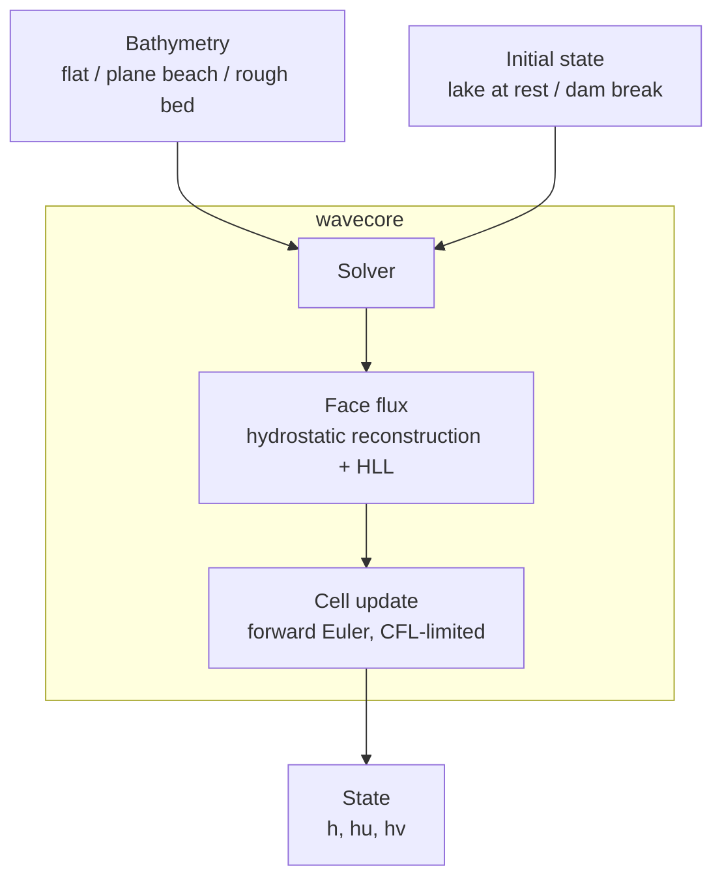

# wavesim


A nearshore wave solver in Rust, built to be verified before it is trusted.

`wavesim` solves the nonlinear shallow-water equations on a Cartesian grid to model how water moves over a sloping or uneven bed. The numerical core, `wavecore`, is a pure library with no I/O, no graphics and no GDAL, and its kernels are pure functions of the cells they touch.

It is a depth-averaged model. It captures shoaling and breaking as a bore, not an overturning lip.

## Table of Contents

- [Overview](#overview)
- [Documentation Map](#documentation-map)
- [Architecture](#architecture)
- [Quick Start](#quick-start)
- [Numerics](#numerics)
- [Verification](#verification)
- [Project Structure](#project-structure)
- [Development](#development)
- [Limitations](#limitations)
- [License](#license)

## Overview

| Component | Description |
|---|---|
| **Grid** | Uniform Cartesian grid in metres, with one ghost layer on every side |
| **Bathymetry** | Bed generators: flat, plane beach, rough bed |
| **State** | Depth `h` and momentum `hu`, `hv`; reflective walls; volume and momentum diagnostics |
| **Solver** | Well-balanced first-order finite-volume scheme with hydrostatic reconstruction and an HLL flux |

Design rules:

1. **Verification first.** Numerical behaviour is pinned by tests with known answers.
2. **Pure numerics.** `wavecore` takes arrays in and gives arrays out. It has no dependencies.
3. **Kernels as pure functions.** A face computation depends only on the two cells that share it, with no allocation or global state.

## Documentation Map

| Doc | What it covers |
|---|---|
| [docs/bathymetry.md](docs/bathymetry.md) | Notes on real-world bed data: NOAA CUDEM for Hawaii, its provenance and caveats, and what was found for Portugal |

## Architecture



## Quick Start

### Prerequisites

- Rust (stable), installed through [rustup](https://rustup.rs)

The solver has no other dependencies.

### Run the tests

```bash
git clone <this-repo>
cd wavesim
cargo test
```

### Lint and format

```bash
cargo fmt --check
cargo clippy --all-targets
```

### Use the library

```rust
use wavecore::{Bathymetry, Grid, Solver, State};

let grid = Grid::new(64, 48, 3.0, 3.0);            // 64 x 48 cells, 3 m each
let bed = Bathymetry::plane_beach(&grid, 0.02, 8.0); // 2% slope, 8 m deep offshore
let mut state = State::lake_at_rest(&grid, &bed, 0.0);
let solver = Solver::new(grid, bed);

let dt = solver.stable_dt(&state);
solver.step(&mut state, dt);
```

## Numerics

The solver integrates the conservative nonlinear shallow-water equations for water depth `h` and depth-integrated momentum `(hu, hv)` over a bed elevation `b`:

```text
∂h/∂t      + ∂(hu)/∂x + ∂(hv)/∂y = 0
∂(hu)/∂t   + ∂(hu² + g h²/2)/∂x + ∂(huv)/∂y = -g h ∂b/∂x
∂(hv)/∂t   + ∂(huv)/∂x + ∂(hv² + g h²/2)/∂y = -g h ∂b/∂y
```

| Aspect | Choice | Why |
|---|---|---|
| Grid | Uniform Cartesian, metres, one ghost layer | Matches raster bed data |
| Discretisation | Cell-centred finite volume | Conserves mass and momentum exactly |
| Bed source term | Hydrostatic reconstruction (Audusse et al. 2004) | Still water stays still over any bed; depth stays non-negative at a shoreline |
| Flux | HLL Riemann solver | Robust at shocks and wet/dry fronts |
| Breaking | Shocks captured by the Riemann solver | No tunable breaking closure |
| Boundaries | Reflective walls | |
| Time step | Adaptive, CFL 0.4, forward Euler | |

Cells shallower than `1e-8` m count as dry and carry no velocity.

## Verification

| Test | Checks |
|---|---|
| Lake at rest over a rough bed | Still water stays still (momentum below 1e-11) and volume is conserved over 500 steps |
| Lake at rest with dry bumps | The same, with wet/dry fronts beside steep bed steps |
| Dam break onto a dry bed | Volume conserved, depth non-negative, water advances into the dry region |

```bash
cargo test
```

## Project Structure

```text
wavesim/
├── Cargo.toml                  # workspace
├── LICENSE
├── README.md
├── docs/
│   └── bathymetry.md           # real-world bed data notes
├── img/
│   └── header-banner.png
└── crates/
    └── wavecore/
        ├── src/
        │   ├── lib.rs
        │   ├── grid.rs         # padded Cartesian grid, metres
        │   ├── bathymetry.rs   # flat, plane beach, rough bed
        │   ├── state.rs        # h, hu, hv, walls, diagnostics
        │   └── solver.rs       # well-balanced HLL finite-volume step
        └── tests/
            └── well_balanced.rs
```

## Development

- **Pure core.** `wavecore` stays free of file I/O, threads, GDAL and graphics.
- **No unsafe.** The workspace forbids `unsafe_code`.
- **Numerics changes come with a test that has a known answer.** A plausible-looking result is not evidence.

## Limitations

- Depth-averaged: no overturning lip, so no barrels.
- First-order and non-dispersive: numerically diffusive, and inaccurate once kh (wavenumber times depth) exceeds roughly 0.3, i.e. where depth is more than about 5% of the wavelength.
- Only still-water and dam-break setups; there is no wave input.
- Bed data comes from synthetic generators only.

## License

MIT. See [LICENSE](LICENSE).
