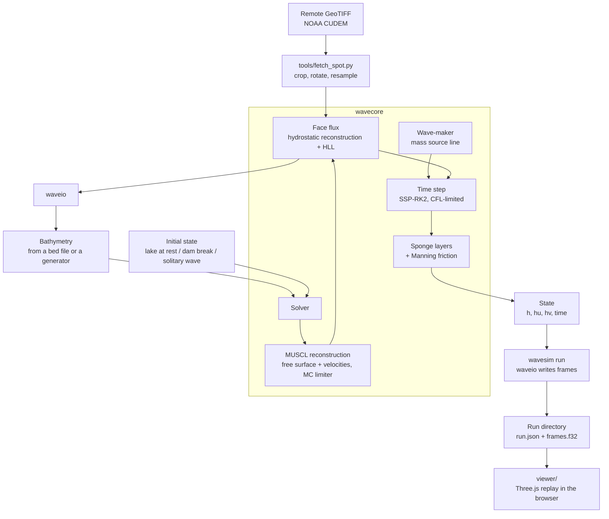

# wavesim


A nearshore wave solver in Rust, built to be verified before it is trusted.

`wavesim` solves the nonlinear shallow-water equations on a Cartesian grid to model how water moves over a sloping or uneven bed, including real 3 m bathymetry cropped from NOAA data. The numerical core, `wavecore`, is a pure library with no I/O, no graphics and no GDAL, and its kernels are pure functions of the cells they touch.

It is a depth-averaged model. It captures shoaling and breaking as a bore, not an overturning lip.

## Table of Contents

- [Overview](#overview)
- [Documentation Map](#documentation-map)
- [Architecture](#architecture)
- [Quick Start](#quick-start)
- [Run a swell over a real bed](#run-a-swell-over-a-real-bed)
- [View a run](#view-a-run)
- [Numerics](#numerics)
- [Verification](#verification)
- [Project Structure](#project-structure)
- [Development](#development)
- [Limitations](#limitations)
- [License](#license)

## Overview

| Component | Description |
|---|---|
| **Grid** | Uniform Cartesian grid in metres, with two ghost layers on every side |
| **Bathymetry** | Bed generators: flat, plane beach, rough bed |
| **State** | Depth `h` and momentum `hu`, `hv`; reflective walls; volume and momentum diagnostics |
| **Forcing** | Internal wave-maker (oblique incidence supported), absorbing sponge layers, Manning bottom friction, optional periodic boundaries in `y` |
| **Bed files** | A documented format for a real seabed; `tools/fetch_spot.py` crops one from a remote GeoTIFF, rotated so `+x` is the wave direction |
| **Runs** | `wavesim run` sends a swell over a bed and writes frames in a documented format a viewer can read |
| **Viewer** | `viewer/`: a browser replay of a run in 3D (Three.js and TypeScript): terrain from the bed, the surface animated from the frames, foam on steep fronts |
| **Solver** | Well-balanced finite-volume scheme: hydrostatic reconstruction, HLL flux, and either first order or second order (MUSCL with an MC limiter, SSP-RK2) |

Design rules:

1. **Verification first.** Numerical behaviour is pinned by tests with known answers.
2. **Pure numerics.** `wavecore` takes arrays in and gives arrays out. It has no dependencies.
3. **Kernels as pure functions.** A face computation depends only on the two cells that share it, with no allocation or global state.

## Documentation Map

| Doc | What it covers |
|---|---|
| [docs/data-format.md](docs/data-format.md) | The bed and run file formats, the coordinate frame, and how to read a run from Python or JavaScript |
| [docs/bathymetry.md](docs/bathymetry.md) | Notes on real-world bed data: NOAA CUDEM for Hawaii, its provenance and caveats, and what was found for Portugal |

## Architecture



## Quick Start

### Prerequisites

- Rust (stable), installed through [rustup](https://rustup.rs)
- [uv](https://docs.astral.sh/uv/) for the fetch tool (only needed to get real bathymetry)
- Node 20 or newer for the viewer (only needed to watch a run)

`wavecore`, the numerical crate, has no dependencies. `waveio` and `wavesim` use `serde`, `serde_json`, `thiserror` and `clap`.

### Run the tests

```bash
git clone <this-repo>
cd wavesim
cargo test
```

### Test the fetch tool

```bash
uv run --python 3.12 --with pytest --with rasterio --with numpy --with scipy --with pyproj pytest tools
```

### Test the viewer

```bash
cd viewer && npm install && npm test
```

### Lint and format

```bash
cargo fmt --check
cargo clippy --all-targets
```

### Use the library

```rust
use wavecore::{Bathymetry, Grid, Solver, State};

let grid = Grid::new(64, 48, 3.0, 3.0);            // 64 x 48 cells, 3 m each
let bed = Bathymetry::plane_beach(&grid, 0.02, 8.0); // 2% slope, 8 m deep offshore
let mut state = State::lake_at_rest(&grid, &bed, 0.0);
let solver = Solver::new(grid, bed);

let dt = solver.stable_dt(&state);
solver.step(&mut state, dt);
```

## Run a swell over a real bed

Fetch the seabed once. This reads only the window it needs (about 1 MB) from NOAA's public bucket:

```bash
uv run --python 3.12 --with rasterio --with numpy --with scipy --with pyproj \
    tools/fetch_spot.py pipeline
```

```bash
cargo run --release -p wavesim -- info data/pipeline.json
```

Send a swell over it:

```bash
cargo run --release -p wavesim -- run data/pipeline.json --height 1.0 --period 14 --duration 300
```

That writes `out/pipeline/` (about 120 MB for 151 frames of 200,000 cells; both `data/` and `out/` are git-ignored). On a laptop it takes about 4.5 minutes for 300 simulated seconds. Options: `--tide` (metres above mean sea level), `--maker-depth` (where the wave-maker goes), `--frame-interval`, `--manning`, `--out`.

The swell travels along `+x` of the bed's frame, so its direction is chosen when the bed is fetched (`bearing` in `spots.toml`). Add your own spot by adding a table to `spots.toml`.

**What a run on Pipeline shows.** With a 1 m, 14 s swell the crest lines curve with the seabed (refraction), the wavelength shortens as the water shoals, and the local wave height grows from about 0.9 m offshore to about 1.7 m near the reef ledge before it falls off again over the last 100 m to the shore.

**Its limit, stated plainly.** The equations have no dispersion, so large waves steepen into shocks within tens of metres. At 2.5 m, in 8 m of water, the swell has already lost about half its height to bores before it reaches the reef, and the offshore-going half is affected too. The run stays stable and the bores are real shock-captured breaking, but where and how a big wave breaks is not trustworthy until the model is dispersive. Use small swells to look at refraction and shoaling.

## View a run

```bash
cd viewer
npm install
npm run dev
```

Open the address it prints (http://localhost:5173). The dev server lists every run in `out/` (set `WAVESIM_RUNS` to use another folder), and `?run=pipeline` opens one directly. You can also drop `run.json`, `bed.f32` and `frames.f32` onto the page, or use **Open files…**.

The page draws the bed as terrain and the surface as a mesh displaced by the stored `eta`, re-uploaded every frame. Between stored frames it interpolates with a cubic, because a straight line between frames 2 s apart cuts the crest of a 14 s wave by 10%. Controls: play and pause (space), scrub, step by a frame (arrow keys), speed, a **Height ×** slider that stretches heights to make small waves visible, three camera views, and a toggle that marks the wave-maker line and the absorbing zones. Those zones are numerical, not sea, so they are shown on request.

Foam appears where the surface is steep (a slope above about 0.05 to 0.13) and in very shallow water at the shoreline. It is a steepness rule for showing where fronts are, not a breaking model. With the 2.5 m swell it lights up the bores that the non-dispersive equations produce, including on the offshore side, which makes that limitation easy to see.

`npm run build` makes a static site in `viewer/dist`; it contains no runs, which are large and git-ignored.

## Numerics

The solver integrates the conservative nonlinear shallow-water equations for water depth `h` and depth-integrated momentum `(hu, hv)` over a bed elevation `b`:

```text
∂h/∂t      + ∂(hu)/∂x + ∂(hv)/∂y = 0
∂(hu)/∂t   + ∂(hu² + g h²/2)/∂x + ∂(huv)/∂y = -g h ∂b/∂x
∂(hv)/∂t   + ∂(huv)/∂x + ∂(hv² + g h²/2)/∂y = -g h ∂b/∂y
```

| Aspect | Choice | Why |
|---|---|---|
| Grid | Uniform Cartesian, metres, two ghost layers | Matches raster bed data; a second-order boundary face reaches two cells out |
| Discretisation | Cell-centred finite volume | Conserves mass and momentum exactly |
| Bed source term | Hydrostatic reconstruction (Audusse et al. 2004) | Still water stays still over any bed; depth stays non-negative at a shoreline |
| Reconstruction | MUSCL on the free surface `h + b` and the velocities, MC limiter | Reconstructing the surface, not the depth, keeps a flat surface exactly flat |
| Flux | HLL Riemann solver | Robust at shocks and wet/dry fronts |
| Breaking | Shocks captured by the Riemann solver | No tunable breaking closure |
| Boundaries | Reflective walls; optionally periodic in `y` | Periodic gives an alongshore-uniform wave with no edge diffraction |
| Wave input | Internal mass source on a line (Wei et al. 1999), Gaussian-weighted, normalised over the discrete grid | Injects exactly the requested amplitude at any resolution; oblique waves via a phase shift along the line |
| Absorption | Sponge layer: momentum decays, surface relaxes to still water, quadratic ramp | Lets waves leave without reflecting |
| Friction | Manning, semi-implicit | Exact for one-directional quadratic drag; never reverses the flow |
| Time step | Adaptive, CFL 0.4; SSP-RK2 (second order) or forward Euler (first order) | |

Cells shallower than `1e-8` m count as dry and carry no velocity. A cell drops to first order where it or a neighbour is shallower than 1 mm, or where reconstruction would leave a face without water, so wet/dry fronts stay positive and well-balanced.

Choose the order with `Solver::with_order(Order::First)`; the default is `Order::Second`.

**Wave-maker calibration.** A source of strength `Q` per unit length radiates amplitude `Q / (2 c cos θ)` on each side, with `c = sqrt(g h)` at the source. That relation holds for long waves, which is the regime the non-dispersive equations describe. A sponge behind the maker absorbs the half that travels away from the domain of interest. With `periodic_y`, an oblique maker's `k_y · Ly` must be a whole multiple of 2π; `Solver` panics if it is not.

## Verification

| Test | Checks |
|---|---|
| Lake at rest over a rough bed | Still water stays still (momentum below 1e-11) and volume is conserved over 500 steps |
| Lake at rest with dry bumps | The same, with wet/dry fronts beside steep bed steps |
| Dam break onto a dry bed | Volume conserved, depth non-negative, water advances into the dry region |
| Wet-bed dam break vs the Stoker solution | Second order at least 4× more accurate than first order; observed L1 convergence rate above 0.9 (measured 1.07) |
| Dry-bed dam break vs the Ritter solution | The same criteria (measured rate 1.03) |
| Exact-solution self-check | The Stoker middle state satisfies the Rankine–Hugoniot conditions |
| Wave-maker amplitude | Radiated amplitude within 5% of the request on both sides (measured 1.4% and 1.6% low, from numerical dissipation) |
| Green's law | Amplitude ratio over a sloping bed within 2% of `(h₁/h₂)^¼` (measured 0.14% off) |
| Snell's law and wave action | Oblique long waves on a beach: alongshore phase lag equals the imposed `k_y` (within 0.05 rad, measured 0.003), the wave turns from 29.3° to 26.8°, and amplitude follows `a² c cos θ = const` (measured 0.02% off) |
| Solitary-wave runup | Non-breaking runup within 10% of Synolakis' law (measured 1.5% high) |
| Friction | Attenuation over 100 m within 0.03 of the quadratic-drag prediction (measured 0.919 against 0.911) |
| Manning factor | Equals the exact solution of quadratic drag |
| Bed and run files | Round-trip exactly; wrong length, NaN values and unknown formats are rejected with a clear message |
| Full run on a synthetic beach | Frame count and times are right, the first frame is still water, and the wave in the frames has the requested amplitude (between 0.6 and 1.3 times the request) |
| Run planning | The wave-maker goes where the water first reaches the requested depth, moves seaward at high tide, and impossible setups are explained |
| Viewer data layer | 24 tests: header and file validation, frame offsets, cubic interpolation (follows a wave with under 2% error where a straight line errs by 10%; never puts water below the bed), and reading the exact bytes the Rust writer produces |
| Rust and viewer agree | `waveio`'s golden test writes a tiny run and compares it byte for byte with the fixture the viewer's tests read; if the format drifts, one of them fails |
| Fetch tool | On a synthetic plane, `+x` follows the bearing and `+y` is 90° counter-clockwise from it, for four bearings; clipping is counted; a request outside the raster is an error |

The lake-at-rest and dam-break conservation tests run for both orders. L1 error at a shock converges at rate 1 at best, so a rate near 1 is the target, not 2.

**Two shoaling tests run in the linear regime.** Green's law and the wave-action law are linear results. At 3 cm in about 2 m of water, nonlinear steepening of shallow-water waves already drains a few percent of the first harmonic over 160 m, so those two tests use 5 mm waves. The beaches are long enough that the measurement points sit well away from the sponge, whose small reflection otherwise ripples the amplitude by a few percent.

`cargo test` takes about 20 seconds: the wave tests are simulations, so the test profile is optimised (`[profile.test] opt-level = 3`).

```bash
cargo test
```

## Project Structure

```text
wavesim/
├── Cargo.toml                  # workspace
├── LICENSE
├── README.md
├── spots.toml                  # real-world spots the fetch tool can crop
├── docs/
│   ├── bathymetry.md           # real-world bed data notes
│   └── data-format.md          # bed and run file formats
├── img/
│   └── header-banner.png
├── viewer/                     # browser replay: Vite, TypeScript, Three.js
│   ├── index.html
│   ├── vite.config.ts          # also serves out/ as /runs/
│   ├── src/
│   │   ├── run.ts              # header checks, frames, interpolation (no DOM)
│   │   ├── load.ts             # fetch or file loading
│   │   ├── view.ts             # terrain, water shader, camera
│   │   ├── main.ts             # controls and playback
│   │   └── style.css
│   └── tests/
│       ├── run.test.ts
│       └── fixtures/tiny/      # written by waveio's golden test
├── tools/
│   ├── fetch_spot.py           # crop, rotate and resample a remote GeoTIFF
│   └── tests/test_fetch_spot.py
└── crates/
    ├── wavecore/               # pure numerics, no dependencies
    │   ├── src/
    │   │   ├── lib.rs
    │   │   ├── grid.rs         # padded Cartesian grid, metres, two ghost layers
    │   │   ├── bathymetry.rs   # flat, plane beach, rough bed, from raw values
    │   │   ├── forcing.rs      # wave-maker, sponge layers, Manning friction
    │   │   ├── state.rs        # h, hu, hv, time, boundaries, diagnostics
    │   │   └── solver.rs       # MUSCL + hydrostatic reconstruction, HLL flux, SSP-RK2
    │   └── tests/
    │       ├── well_balanced.rs  # still water stays still; conservation
    │       ├── stoker.rs         # dam breaks against exact solutions
    │       └── waves.rs          # wave-maker, shoaling, refraction, friction, runup
    ├── waveio/                 # all file I/O: bed files and run directories
    │   ├── src/{lib,bed,run,error}.rs
    │   └── tests/{formats,golden}.rs
    └── wavesim/                # the command line: `run` and `info`
        ├── src/{lib,main}.rs
        └── tests/run.rs
```

## Development

- **Pure core.** `wavecore` stays free of file I/O, threads, GDAL and graphics.
- **No unsafe.** The workspace forbids `unsafe_code`.
- **Numerics changes come with a test that has a known answer.** A plausible-looking result is not evidence.

## Limitations

- Depth-averaged: no overturning lip, so no barrels.
- First order at shorelines: cells at or beside a wet/dry front drop to first order to stay positive, so runup is more diffusive than the open water.
- Non-dispersive: inaccurate once kh (wavenumber times depth) exceeds roughly 0.3, i.e. where depth is more than about 5% of the wavelength.
- Wave input is monochromatic and calibrated for long waves; there is no irregular sea state or spectrum.
- Non-dispersive waves steepen as they travel, so a sinusoid loses first-harmonic amplitude to higher harmonics over long distances.
- The sponge reflects a little (a few percent at about one wavelength wide); measure well away from it.
- Real bathymetry exists at 3 m only where measured surveys exist (see [docs/bathymetry.md](docs/bathymetry.md)). For most coasts, including Portugal's, no open reef-scale data was found.
- `wavesim run` sends one monochromatic swell along `+x` of the bed's frame; the direction is fixed when the bed is fetched.
- The viewer loads a whole run into memory (120 MB for the Pipeline run) and needs WebGL2. There is no compact export yet, so runs are for local viewing, not hosting.
- The wave-maker sits at a single depth, and its amplitude is calibrated for the depth along the middle row.

## License

MIT. See [LICENSE](LICENSE).
